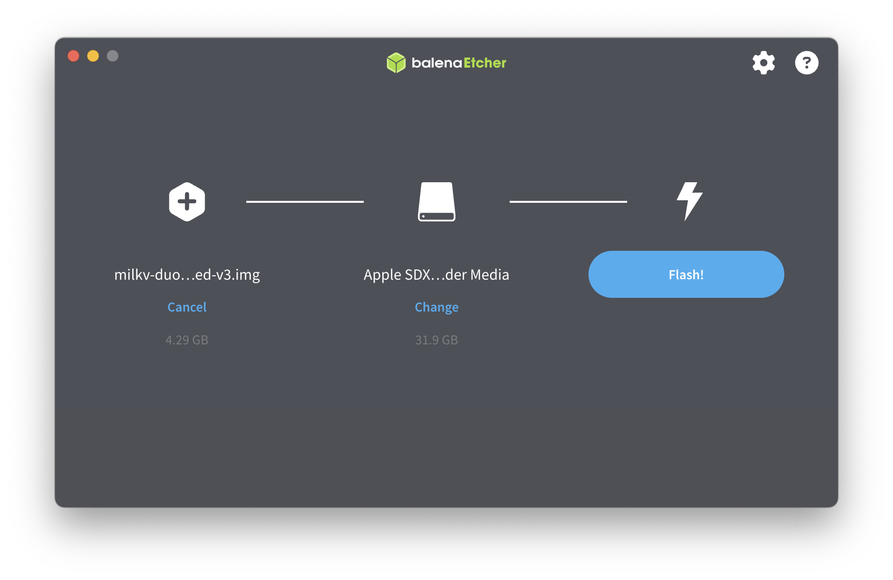
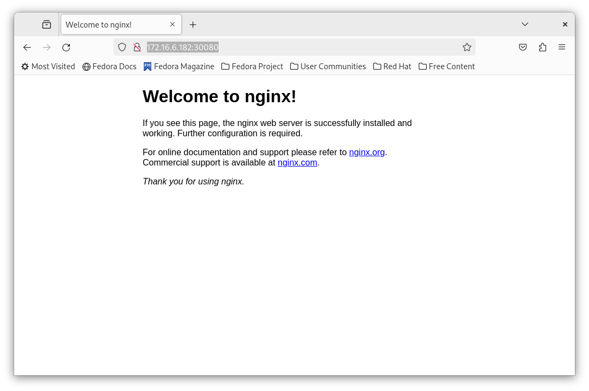

# ARM

在当前 buildroot-sdk 版本的 riscv 环境下，启用部分内核功能可能会对性能造成影响导致使用异常，这些内核功能又是 k3s 必须的，而在 ARM 核下的 DuoS 则不存在这个问题。轻轻地拨动 DuoS 的开关至 ARM 档位（位于 Type-C 口下方），以下步骤将尝试在 Milk-V DuoS 的 ARM 核下一同完成 k3s 的运行。

注：releases 中已提供刷入镜像，如使用 releases 中的镜像则仅需从 0x0A 开始，其中 0x00-0x07 为镜像打包流程， 0x08-0x09 为服务器搭建过程， 0x0A-0x0B 为 DuoS 镜像刷入过程， 0x0C 为服务端下发配置过程。

环境说明：

移植系统：Fedora Minimal 40

移植架构：ARM

K3S版本：v1.30.3+k3s1

## 0x00 准备环境

我们可以到fedora的官网上下载 ARM 的镜像文件备用 [https://download.fedoraproject.org/pub/fedora/linux/releases/40/Spins/aarch64/images/Fedora-Minimal-40-1.14.aarch64.raw.xz](https://download.fedoraproject.org/pub/fedora/linux/releases/40/Spins/aarch64/images/Fedora-Minimal-40-1.14.aarch64.raw.xz)

需要注意的是，Milk-V Duo 默认的仓库 duo-buildroot-sdk 仅支持 riscv 下使用，如果要为 ARM 核编译内核，需要使用 duo-buildroot-sdk-v2 来编译。

在 Fedora 下，我们可以轻松地使用toolbox创建ubuntu环境，然后在ubuntu环境下编译buildroot

```bash
sudo dnf install toolbox
toolbox create --distro ubuntu --release 22.04
toolbox enter ubuntu-toolbox-22.04
```

https://github.com/milkv-duo/duo-buildroot-sdk-v2

先安装必要的组建，然后克隆仓库

```bash
sudo apt install -y git pkg-config build-essential ninja-build automake autoconf libtool wget curl git gcc libssl-dev bc slib squashfs-tools android-sdk-libsparse-utils jq python3-distutils scons parallel tree python3-dev python3-pip device-tree-compiler ssh cpio fakeroot libncurses5 flex bison libncurses5-dev genext2fs rsync unzip dosfstools mtools tcl openssh-client cmake expect

git clone https://github.com/milkv-duo/duo-buildroot-sdk-v2
```

环境准备就绪，可以准备编译了。

## 0x01 修改编译配置

要在 Milk-V DuoS 上运行 K3S ，首先我们要让它的内核支持部分功能。而由于Milk-V DuoS的内核配置经过了许多简化，与上面类似，我们需要先修改内核配置（build/boards/cv181x/sg2000_milkv_duos_glibc_arm64_sd/linux/cvitek_sg2000_milkv_duos_glibc_arm64_sd_defconfig）让它支持以下功能：

- SWAP
- SELINUX
- CGROUPS
- NetFilter
- ZRAM
- Audit
- VLAN
- etc…

为此，我们需要修改以下配置：

build/boards/cv181x/sg2000_milkv_duos_glibc_arm64_sd/linux/cvitek_sg2000_milkv_duos_glibc_arm64_sd_defconfig

修改的内核配置文件已附于仓库中。

同时，因为我们这里还是用不上FreeRTOS，所以我们也同样不给ISP分配内存，可以修改 memmap 将其内存设为0来提升利用率。

```bash
--- a/build/boards/cv181x/sg2000_milkv_duos_glibc_arm64_sd/memmap.py
+++ b/build/boards/cv181x/sg2000_milkv_duos_glibc_arm64_sd/memmap.py
@@ -40,10 +40,10 @@ class MemoryMap:
     # =================
     # Multimedia buffer. Used by u-boot/kernel/FreeRTOS
     # =================
-    ION_SIZE = 70 * SIZE_1M
-    H26X_BITSTREAM_SIZE = 2 * SIZE_1M
+    ION_SIZE = 0 * SIZE_1M
+    H26X_BITSTREAM_SIZE = 0 * SIZE_1M
     H26X_ENC_BUFF_SIZE = 0
-    ISP_MEM_BASE_SIZE = 20 * SIZE_1M
+    ISP_MEM_BASE_SIZE = 0 * SIZE_1M
     FREERTOS_RESERVED_ION_SIZE = H26X_BITSTREAM_SIZE + H26X_ENC_BUFF_SIZE + ISP_MEM_BASE_SIZE

     # ION after FreeRTOS
```

同时，由于Fedora本身的大小超过了DuoS原有分区容量，我们需要修改分区大小 build/boards/cv181x/sg2000_milkv_duos_glibc_arm64_sd/partition/partition_sd.xml

```bash
<partition label="ROOTFS" size_in_mb="4096" readonly="false" file="rootfs.sd" />
```

以上对文件的修改均已放入仓库中 arch/arm 目录下。

## 0x02 开始编译

切换目录至 duo-buildroot-sdk-v2 ，开始进行编译

`./build.sh milkv-duos-glibc-arm64-sd`

编译完成后，会在 ./out 文件夹下生成一个 milkv-duos 的镜像文件。下一步，我们要将它挂载起来。

## 0x03 拷贝rootfs

使用 `sudo losetup -fP Fedora-Minimal-40-1.14.aarch64.raw` 来挂载刚刚下载的Fedora到loop上，使用 `sudo losetup -fP milkv-duos-fedora-aarch64.img` 挂载刚刚编译出来的镜像。

创建两个文件夹并挂载

```bash
mkdir -p rootfs fedora

sudo losetup -fP Fedora-Minimal-40-1.14.aarch64.raw
sudo losetup -fP milkv-duos-fedora-aarch64.img

# 检查挂载位置，未挂载loop情况下，Fedora Minimal会位于 /dev/loop0，新编译的镜像会位于 /dev/loop1
lsblk

# 不重新格式化，可能会出现 the backing extfs filesystem is formatted without d_type support 的提示
sudo mkfs.ext4 -f /dev/loop1p2

sudo mount /dev/loop0p3 fedora
sudo mount /dev/loop1p2 rootfs

# 切换到rootfs目录删除掉所有原有的内容
pushd rootfs
sudo rsync -avhP ../fedora/ ./

# 复制内核内容
sudo cp -r ../../linux_5.10/build/sg2000_milkv_duos_glibc_arm64_sd/modules/lib/modules/5.10.4-tag- /lib/modules/
popd

```

## 0x04 修改配置并安装必要软件

检查并修改fstab，不然启动过程中会报错出问题

```bash
> ls -lha /dev/disk/by-uuid/ | grep loop
58dd6104-fd46-4bcf-8506-3e3cf67c3a83 -> ../../loop1p2
7B77-95E7 -> ../../loop1p1

> vim etc/fstab
UUID=58dd6104-fd46-4bcf-8506-3e3cf67c3a83       /       ext4    defaults        0       0
UUID=7B77-95E7  /boot   vfat    defaults,uid=0,gid=0,umask=077,shortname=winnt  0       2
```

暂时更换 resolv.conf 来规避DNS访问错误

```bash
mv /etc/resolv.conf /etc/resolv.conf_bak
echo "nameserver 114.114.114.114" > /etc/resolv.conf
```

在宿主机环境下，使用chroot切换到该镜像中（注意要安装 qemu-user-aarch64）

```bash
sudo chroot rootfs

# 更换镜像源
sed -e 's|^metalink=|#metalink=|g' \
    -e 's|^#baseurl=http://download.example/pub/fedora/linux|baseurl=https://mirrors.tuna.tsinghua.edu.cn/fedora|g' \
    -i.bak \
    /etc/yum.repos.d/fedora.repo \
    /etc/yum.repos.d/fedora-updates.repo
    
dnf update -y

dnf config-manager \
    --add-repo \
    https://mirrors.tuna.tsinghua.edu.cn/docker-ce/linux/fedora/docker-ce.repo
    
sed -i 's+https://download.docker.com+https://mirrors.tuna.tsinghua.edu.cn/docker-ce+' /etc/yum.repos.d/docker-ce.repo
dnf install tmux vim docker-ce docker-ce-cli containerd.io docker-buildx-plugin docker-compose-plugin
systemctl enable docker
```

由于ARM下已经有预编译好的 k3s 二进制包，并不需要另外编译，我们可以按照原教程一键安装k3s，并等待就绪，注意该操作在镜像的 chroot 环境中进行。

```bash
curl -sfL https://get.k3s.io | K3S_URL=https://example.com K3S_TOKEN=xxxxxxxx sh -s - --docker
```

镜像默认没有密码，需要先手动设置一个 root 密码，此处镜像密码设置为 root

```bash
> passwd
# root
New password:
Retype new password:
passwd: password updated successfully
```

## 0x05 修改SELINUX配置与iptables设置

初次启动的时候可能会出现以下错误

1. Failed to set SELinux security context system_u:object_r:sysfs_t:s0 for /sys/kernel/security: Permission denied
2. Failed to set SELinux security context system_u:object_r:tmpfs_t:s0 for /dev/shm: Permission denied

所以我们需要先将selinux设成permissive，然后在根目录下创建 .autolabel

```bash
> vi /etc/selinux/config
SELINUX=permissive

touch /.autorelabel
```

在nft下iptables无法被append，切换到传统iptables来解决问题

```bash
dnf install iptables-legacy

> update-alternatives --config iptables

There are 2 programs which provide 'iptables'.

  Selection    Command
-----------------------------------------------
*+ 1           /usr/sbin/iptables-nft
   2           /usr/sbin/iptables-legacy

Enter to keep the current selection[+], or type selection number: 2
```

## 0x06 删除镜像多余的日志

```bash
# 退出chroot
exit

# 清除bash相关日志内容
mv ./etc/resolv.conf_bak ./etc/resolv.conf
rm -rf ./root/.bash_*
echo > /var/log/dnf.log
echo > /var/log/dnf.rpm.log
echo > /var/log/dnf.librepo.log
echo > /var/log/hawkey.log

```

## 0x07 umount并压缩镜像

umount镜像

```bash
sudo umount rootfs
sudo losetup -D
```

压缩镜像并上传

```bash
pigz milkv-duos-fedora-aarch64-modified.img
```

---

用户操作从此处开始，以上内容已被打包为镜像，此处为服务端搭建，服务端搭建不要求在DuoS上，所以可以找任一架构的服务端进行。

## 0x08 k3s 服务端搭建

在其他任意一台机器上，先安装部署好 Fedora ，然后按照步骤安装 Docker

```bash
sed -e 's|^metalink=|#metalink=|g' \
    -e 's|^#baseurl=http://download.example/pub/fedora/linux|baseurl=https://mirrors.tuna.tsinghua.edu.cn/fedora|g' \
    -i.bak \
    /etc/yum.repos.d/fedora.repo \
    /etc/yum.repos.d/fedora-updates.repo
    
dnf update -y

dnf config-manager \
    --add-repo \
    https://mirrors.tuna.tsinghua.edu.cn/docker-ce/linux/fedora/docker-ce.repo
    
sed -i 's+https://download.docker.com+https://mirrors.tuna.tsinghua.edu.cn/docker-ce+' /etc/yum.repos.d/docker-ce.repo
dnf install docker-ce docker-ce-cli containerd.io docker-buildx-plugin docker-compose-plugin
systemctl enable docker
```

并安装 k3s ，等待就绪

```bash
curl -sfL https://get.k3s.io | sh -s - --docker
```

## 0x09 获取服务器参数

确保 Fedora 服务器位于DuoS可访问的网络内，记录其 token 和 ip 信息

```bash
> cat /var/lib/rancher/k3s/server/token
K10cf76ffffffffd3982eda1cfffffff1ce6539c6dffffffffffffffffffffffbc::server:598fffffff78fffffff8ffffffffffff

> ip a
inet 172.16.x.x/24 brd 172.16.6.255 scope global dynamic noprefixroute ens160
```

---

DuoS的配置从此处开始

## 0x0A 烧录镜像

插入SD卡，选择刚准备好的镜像，使用BalenaEtcher直接刷入



将刷入好的SD卡插入到DuoS中，注意拨动开关切换到ARM核来启动

## 0x0B 启动 Milk-V DuoS 并进行配置

启动前确保开关置于ARM档位。首次开机可能需要大概5分钟时间，请耐心等待DuoS启动后再继续，镜像首次开机后会修复 SELinux Label ，所以会自动重启一次。首次启动可先断开网络，镜像帐号密码为 root:root 。

修改hostname

```bash
> vim /etc/hostname
Milk-V-DuoS-3
```

修改以下配置后重启

```bash
> vim /etc/systemd/system/k3s-agent.service.env

K3S_TOKEN="xxxx::server:xxxx"
K3S_URL="https://x.x.x.x:6443"
```

重启后接入网络，正常情况下服务端将会检查到新增 node ，但也可能因为系统时间不对而导致出现奇怪的问题(比如检查 k3s-agent 时发现一直提示证书错误，或者在更新与安装软件包时出现证书错误)，可以通过使用timedatectl校准时间来解决。

在服务端上检查链接情况

```bash
> kubectl get nodes
NAME            STATUS     ROLES                  AGE     VERSION
fedora          Ready      control-plane,master   6h      v1.30.3+k3s1
milk-v-duos     NotReady   <none>                 1h      v1.30.3+k3s1
milk-v-duos-2   NotReady   <none>                 3h37m   v1.30.3+k3s1
milk-v-duos-3   Ready      <none>                 13s     v1.30.3+k3s1

```

```bash
> kubectl label node milk-v-duos-3 machine=milkv
node/milk-v-duos-3 labeled
```

## 0x0C 在服务端上部署nginx

在服务端上编写deployment文件，进行部署

```bash
kubectl apply -f deployment.yaml
```

deployment.yaml

```text
apiVersion: apps/v1   
kind: Deployment    
metadata:            
  name: nginx-deployment    
  labels:        
    app: nginx    
spec:            
  replicas: 1    
  selector:       
    matchLabels: 
      app: nginx
  template:        
    metadata:    
      labels:    
        app: nginx
    spec:
      nodeSelector:
        machine: milkv
      containers:    
      - name: nginx
        image: nginx:alpine    
        ports:
          - containerPort: 80 
```

```bash
kubectl apply -f services.yaml
```

services.yaml

```text
apiVersion: v1
kind: Service  
metadata:
  name: nginx-service  
spec:
  selector:    
    app: nginx 
  ports:  
  - protocol: TCP  
    port: 80 
    targetPort: 80 
    nodePort: 30080 
  type: NodePort
```

部署完成后查看service状态

```bash
> kubectl get services
NAME            TYPE        CLUSTER-IP     EXTERNAL-IP   PORT(S)        AGE
kubernetes      ClusterIP   10.43.0.1      <none>        443/TCP        6h
nginx-service   NodePort    10.43.179.60   <none>        80:30080/TCP   3m

```

浏览器访问 http://&lt;DuoS-IP&gt;:30080 ，显示nginx默认页为成功，至此ARM K3S部署教程结束

