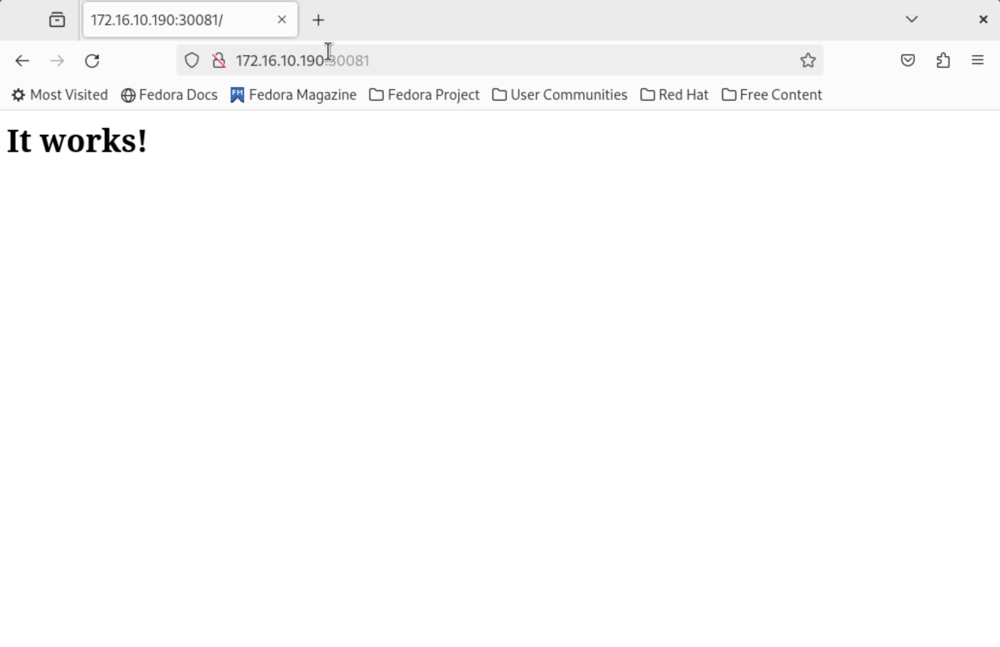

# RISC-V

服务器配置过程已在 ARM 章中 0x08~0x09 节写出，此处不再赘述。二进制文件已放入镜像中的 /home/k3s 文件夹。

注：release 中已提供刷入镜像，如使用 releases 中的镜像则仅需从 0x05 开始。0x01-0x03 节为镜像制作过程，0x04 为 RISC-V 的 k3s 二进制编译过程，0x05-0x07 节为 DuoS 配置过程，0x08 为服务器下发配置过程

环境说明：

移植系统：Arch Linux

移植架构：RISC-V

K3S自编译版本：v1.30.2+k3s-0ee714d6-dirty

## 0x01 移植 Arch Linux 至 DuoS

由于 Arch Linux on RISC-V 已有 Docker 支持，所以我们可以直接将 Arch Linux 移植至 DuoS 上，再在 Arch Linux 的基础上运行 k3s 。在编译过程中需要修改内核参数开启部分内核支持。

可以先下载好 archriscv 的 rootfs 镜像 [https://archriscv.felixc.at/images/archriscv-latest.tar.zst](https://archriscv.felixc.at/images/archriscv-latest.tar.zst)

先使用 duo-buildroot-sdk 制作一个 buildroot 的镜像，再通过替换 rootfs 的方式来移植 Arch Linux。按照官方文档，可以先安装toolbox，再用 toolbox 准备一个 ubuntu 22.04 的容器环境。

```bash
toolbox create --distro ubuntu --release 22.04
toolbox enter ubuntu-toolbox-22.04
```

然后按照文档进行准备操作

```bash
sudo apt install -y pkg-config build-essential ninja-build automake autoconf libtool wget curl git gcc libssl-dev bc slib squashfs-tools android-sdk-libsparse-utils jq python3-distutils scons parallel tree python3-dev python3-pip device-tree-compiler ssh cpio fakeroot libncurses5 flex bison libncurses5-dev genext2fs rsync unzip dosfstools mtools tcl openssh-client cmake expect
git clone https://github.com/milkv-duo/duo-buildroot-sdk --depth=1
```

修改以下文件，修改的文件内容已附于仓库

`boards/cv181x/cv1813h_milkv_duos_sd/linux/cvitek_cv1813h_milkv_duos_sd_defconfig`

同时，因为我们这里用不上FreeRTOS，所以我们不给ISP分配内存，可以修改 memmap 将其内存设为0来提升利用率。

```bash
--- a/build/boards/cv181x/cv1813h_milkv_duos_sd/memmap.py
+++ b/build/boards/cv181x/cv1813h_milkv_duos_sd/memmap.py
@@ -40,10 +40,10 @@ class MemoryMap:
     # =================
     # Multimedia buffer. Used by u-boot/kernel/FreeRTOS
     # =================
-    ION_SIZE = 70 * SIZE_1M
-    H26X_BITSTREAM_SIZE = 2 * SIZE_1M
+    ION_SIZE = 0 * SIZE_1M
+    H26X_BITSTREAM_SIZE = 0 * SIZE_1M
     H26X_ENC_BUFF_SIZE = 0
-    ISP_MEM_BASE_SIZE = 20 * SIZE_1M
+    ISP_MEM_BASE_SIZE = 0 * SIZE_1M
     FREERTOS_RESERVED_ION_SIZE = H26X_BITSTREAM_SIZE + H26X_ENC_BUFF_SIZE + ISP_MEM_BASE_SIZE

     # ION after FreeRTOS
```

编译针对 milkv-duos-sd 的镜像

```bash
./build.sh milkv-duos-sd
```

## 0x02 开始编译

切换目录至 duo-buildroot-sdk ，开始进行编译

`./build.sh milkv-duos-sd`

编译完成后，会在 ./out 文件夹下生成一个 milkv-duos 的镜像文件。下一步，我们要将它挂载起来。

## 0x03 拷贝rootfs

使用 `sudo losetup -fP milkv-duos-sd-20240807-1716.img` 挂载刚刚编译出来的镜像。

创建两个文件夹并挂载

```bash
mkdir -p rootfs

LOOP_DEVICE=$(losetup -f)
sudo losetup -fP milkv-duos-sd-20240807-1716.img

# 检查挂载位置，未挂载loop情况下，新镜像挂载后会位于 /dev/loop0
lsblk

# 不重新格式化，可能会出现 the backing extfs filesystem is formatted without d_type support 的提示
sudo mkfs.ext4 -f "/dev/${LOOP_DEVICE}p3"

sudo mount "/dev/${LOOP_DEVICE}p3" rootfs

# 切换到rootfs目录删除掉所有原有的内容
pushd rootfs
sudo tar -xvf ~/archriscv-latest.tar.zst .

# 复制内核内容
sudo cp -r ../../linux_5.10/build/cv1813h_milkv_duos_sd/modules/lib/modules/5.10.4-tag- /lib/modules/
popd

```

## 0x03 修改配置并安装必要软件

检查并修改fstab，不然启动过程中会报错出问题

```bash
> ls -lha /dev/disk/by-uuid/ | grep loop
58dd6104-fd46-4bcf-8506-3e3cf67c3a83 -> ../../loop0p2
7B77-95E7 -> ../../loop0p1

# 将上面显示的UUID替换到下方
> vim etc/fstab
UUID=58dd6104-fd46-4bcf-8506-3e3cf67c3a83       /       ext4    defaults        0       0
UUID=7B77-95E7  /boot   vfat    defaults,uid=0,gid=0,umask=077,shortname=winnt  0       2
```

在宿主机环境下，使用arch-chroot切换到该镜像中（注意要安装 qemu-user-riscv64 和 arch-install-scripts）

```bash
sudo arch-chroot rootfs

pacman -Syu tmux vim docker docker-compose sudo networkmanager less parted
systemctl enable docker networkmanager
```

新增用户

```bash
> useradd -G wheel -m k3s
> passwd k3s
# k3s@233!
New password:
Retype new password:
passwd: password updated successfully
```

允许 wheel 组使用 sudo，取消注释以下行

```bash
> visudo
%wheel ALL=(ALL:ALL) ALL
```

## 0x04 编译 k3s

在编译机上安装 golang，修改 k3s 仓库中的 go.mod ，在 go.1.22.4 下方添加以下两行

```bash
replace github.com/marten-seemann/tcp => github.com/r-value/tcp v0.0.0-20211124094235-5d06fda83888
replace inet.af/tcpproxy => github.com/inetaf/tcpproxy v0.0.0-20240214030015-3ce58045626c
```

该操作过程全程需要较好的网络环境（可访问 GitHub/DockerHub）或反复尝试。为保证编译速率，编译过程可在其他设备（如SG2042）上进行。

依次运行以下命令：

- `go mod tidy`
- `scripts/download`
- `scripts/generate`
- `scripts/build`
- `scripts/package-cli`

然后能在 dist/artifacts 获得一份 k3s-riscv64 的二进制包，该二进制包已于 releases 处附上。

## 0x05 刷入镜像并启动DuoS

刷入流程见 ARM 章，启动前应确保启动开关位于RV档位。使用 k3s 用户登入DuoS，首次登入可能会比较慢，密码为 `k3s@233!`

由于 DuoS 内存不大，建议开启 swap，否则可能会循环出现 `Eviction manager: unable to evict any pods from the node` ，当然要提前扩容好分区

```bash
# 扩容分区
> parted

# parted /dev/mmcblk0
GNU Parted 3.6
Using /dev/mmcblk0
Welcome to GNU Parted! Type 'help' to view a list of commands.
(parted) p
Model: SD MSSD0 (sd/mmc)
Disk /dev/mmcblk0: 62.6GB
Sector size (logical/physical): 512B/512B
Partition Table: msdos
Disk Flags:

Number  Start  End     Size    Type     File system  Flags
 1      512B   134MB   134MB   primary  fat16        boot, lba
 3      136MB  2284MB  2147MB  primary  ext4

(parted) resizepart 3 100%
(parted) p
Model: SD MSSD0 (sd/mmc)
Disk /dev/mmcblk0: 62.6GB
Sector size (logical/physical): 512B/512B
Partition Table: msdos
Disk Flags:

Number  Start  End     Size    Type     File system  Flags
 1      512B   134MB   134MB   primary  fat16        boot, lba
 3      136MB  62.6GB  62.5GB  primary  ext4

(parted) q
Information: You may need to update /etc/fstab.

> resize2fs /dev/mmcblk0p3
resize2fs 1.47.1 (20-May-2024)
Filesystem at /dev/mmcblk0p3 is mounted on /; on-line resizing required
old_desc_blocks = 1, new_desc_blocks = 8
The filesystem on /dev/mmcblk0p3 is now 15249919 (4k) blocks long.

dd if=/dev/zero of=/swapfile bs=1M count=4096
mkswap /swapfile
swapon /swapfile

echo "/swapfile none swap defaults 0 0" >> /etc/fstab
```

## 0x06 额外的镜像构建

由于部分必须的镜像并不支持 riscv64 ，因此我们可能还要手动 build 这些镜像，比如 `rancher/klipper-lb` 和 `pause`

先构建 `rancher/klipper-lb` ，可通过以下命令构建

```bash
git clone https://github.com/k3s-io/klipper-lb
pushd klipper-lb
docker build . -t rancher/klipper-lb:v0.4.7
popd
```

如果觉得构建缓慢也可以直接在DuoS上使用预构建好的 klipper-lb

```bash
docker pull hub.oepkgs.net/fedorariscv/klipper-lb:v0.4.7
docker tag hub.oepkgs.net/fedorariscv/klipper-lb:v0.4.7 rancher/klipper-lb:v0.4.7
```

依据 `https://github.com/CARV-ICS-FORTH/kubernetes-riscv64/blob/main/images/pause/Dockerfile` ，可以build一个 ，也可以用 https://hub.docker.com/r/apeqo/pause/tags 的镜像


## 0x07 进行一些配置并启动k3s

修改 /etc/hostname ，比如 milk-v-duos ，然后

尝试运行

```bash
sudo ./k3s-riscv64 agent --server https://x.x.x.x:6443 --token "xxx" --pause-image "docker.io/apeqo/pause:3.9" --docker
```

注意使用docker构建好后不要遗漏 `--docker` ，否则会一直说找不到符合架构的镜像

## 0x08 下发配置

在服务器执行以下命令，可以看到 DuoS 已上线，顺便打个标签方便管理。

```bash
> kubectl get nodes
NAME            STATUS     ROLES                  AGE     VERSION
fedora          Ready      control-plane,master   5h      v1.30.3+k3s1
milk-v-duos     Ready      <none>                 30s     v1.30.2+k3s-0ee714d6-dirty

```

```bash
> kubectl label node milk-v-duos arch=riscv
node/milk-v-duos labeled
```


写deployment文件，进行部署

```bash
kubectl apply -f deployment_rv.yaml
```

deployment_rv.yaml

```text
apiVersion: apps/v1   
kind: Deployment    
metadata:            
  name: httpd-rv64-deployment    
  labels:        
    app: httpd-rv64    
spec:            
  replicas: 1    
  selector:       
    matchLabels: 
      app: httpd-rv64
  template:        
    metadata:    
      labels:    
        app: httpd-rv64
    spec:
      nodeSelector:
        os: arch
      containers:   
      - name: httpd-rv64
        image: riscv64/httpd:alpine 
        ports:
          - containerPort: 80
```

```bash
kubectl apply -f services_rv.yaml
```

services_rv.yaml

```text
apiVersion: v1
kind: Service  
metadata:
  name: httpd-rv64-service  
spec:
  selector:    
    app: httpd-rv64
  ports:  
  - protocol: TCP  
    port: 80 
    targetPort: 80
    nodePort: 30081 
  type: NodePort
```

部署完成后查看service状态

```bash
root@Mac-Fedora-VM:~# kubectl get services
NAME                   TYPE        CLUSTER-IP      EXTERNAL-IP   PORT(S)          AGE
httpd-rv64-service     NodePort    10.43.138.217   <none>        80:30081/TCP     2m
kubernetes             ClusterIP   10.43.0.1       <none>        443/TCP          6h
```

## 0x09 检查

访问 http://&lt;DuoS-IP&gt;:30081 ，可看到 It works! 即为成功。



## 0x0A 后续

其实 k3s-agent.service systemd 文件也可以一同集成进镜像，但为了方便调试，还是单独拎出来，需要的时候再放进去，文件已放置到 arch/riscv 目录下，需要时可以将测试好的环境修改后，将 `/home/k3s/k3s-riscv64` 放置至 /usr/local/bin/k3s ，并将 k3s-agent.service* 放置至 /etc/systemd/system 并使用 `systemctl enable k3s-agent` 启用